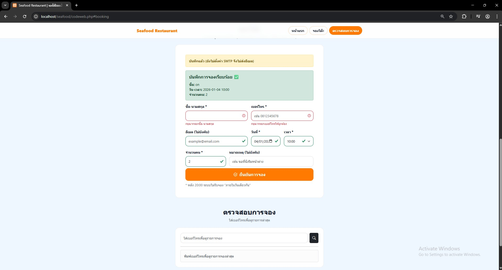

# 🍽️ Restaurant Booking System (PHP Single-file)

ระบบจองโต๊ะร้านอาหารออนไลน์แบบ **Single-file Architecture** พัฒนาด้วย **PHP (PDO)** และ **MySQL** ออกแบบมาให้ติดตั้งง่าย ปลอดภัย และรองรับการใช้งานจริง พร้อมระบบแจ้งเตือนผ่านอีเมล


---

## 📸 ภาพหน้าจอ (Screenshots)

### 1. หน้าหลัก (Home)


### 2. การจองโต๊ะ (Booking)
**แบบปกติ (ไม่ใส่อีเมล):**


**แบบใส่อีเมล (เพื่อรับการแจ้งเตือน):**


### 3. การแจ้งเตือนทางอีเมล (Email Notification)


### 4. ตรวจสอบประวัติการจอง (Check Booking)


---

## ✨ ฟีเจอร์เด่น (Key Features)

### 🖥️ ฝั่งผู้ใช้งาน (Frontend)
- **Responsive Design:** แสดงผลสวยงามบนมือถือและคอมพิวเตอร์ (Bootstrap 5)
- **Real-time Validation:** ตรวจสอบข้อมูลทันทีขณะกรอก (jQuery)
- **Smart Time Slots:** ระบบสร้างตัวเลือกเวลาจองอัตโนมัติ ตามเวลาเปิด-ปิดร้าน
- **Booking History:** ตรวจสอบประวัติการจองย้อนหลังได้ด้วยเบอร์โทรศัพท์

### ⚙️ ฝั่งระบบ (Backend Logic)
- **Auto Database Setup:** สร้างตาราง Database อัตโนมัติเมื่อรันครั้งแรก
- **Smart Logic:**
  - ป้องกันการจองซ้ำ (Duplicate Booking Protection)
  - ตัดรอบการจองของวันปัจจุบัน (Cutoff Time)
  - จำกัดจำนวนโต๊ะต่อช่วงเวลา (Max bookings per slot)
- **Email Notification:** ส่งอีเมลยืนยันลูกค้าและแจ้งเตือนร้านค้าผ่าน SMTP (Gmail)
- **Security:** CSRF Protection, PDO Prepared Statements, Session Hardening

---
## โครงสร้าง
```text
restaurant-booking/
├─ codeweb.php          # ไฟล์หลักของระบบ (Run ไฟล์นี้)
├─ vibe.png             # รูปภาพประกอบ 
├─ padthai.png          # รูปเมนูอาหาร
├─ grilledshrimp.png    # รูปเมนูอาหาร
├─ oysters.png          # รูปเมนูอาหาร
├─ seafood.gitignore           # ไฟล์ระบุสิ่งที่ Git ไม่ควรเก็บ
├─ .env.example         # ตัวอย่างไฟล์ตั้งค่า Environment
├─ composer.json        # ไฟล์ระบุ Dependency (PHPMailer)
├─ composer.lock
├─ vendor/              # โฟลเดอร์ Library (ถูกสร้างหลังรัน composer install)
└─ README.md            # คู่มือการใช้งาน
```
## 🛠️ การติดตั้ง (Installation)

### 1. Requirements
- PHP 7.4 ขึ้นไป
- MySQL / MariaDB
- Composer (สำหรับติดตั้ง PHPMailer)

### 2. ติดตั้ง Library

cd /path/to/project
composer require phpmailer/phpmailer

### 3. ตั้งค่าโปรเจกต์
- วางโปรเจกต์ใน XAMPP: `C:\xampp\htdocs\restaurant-booking`
- เปิดเว็บ: `http://localhost/restaurant-booking/codeweb.php`

### 4. ตั้งค่า Database (ค่าเริ่มต้นในโค้ด)
- Host: `127.0.0.1`
- User: `root`
- Pass: *(ว่าง)*
- DB: `restaurant_booking_ui`
> โหมด local จะสร้าง DB/Table ให้อัตโนมัติ (AUTO_SETUP_DB=1)

### 5. ตั้งค่าอีเมล (ไม่บังคับ)
สร้างไฟล์ `.env` (ห้ามอัปขึ้น GitHub) แล้วใส่:
```env
APP_ENV=local
AUTO_SETUP_DB=1
SMTP_USER=yourgmail@gmail.com
SMTP_PASS=your_app_password

