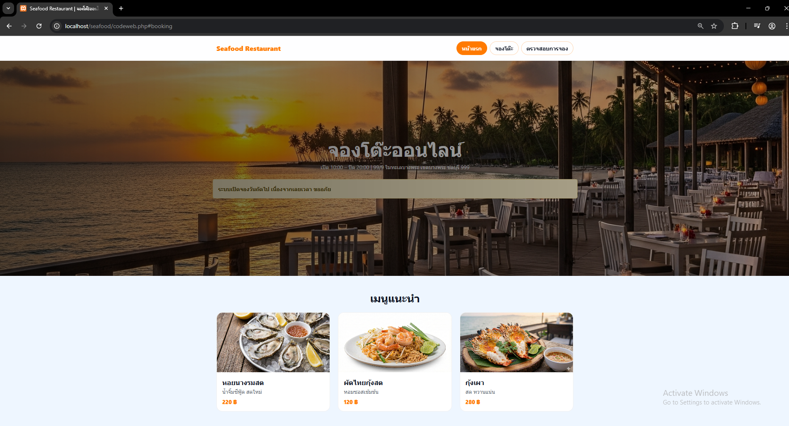
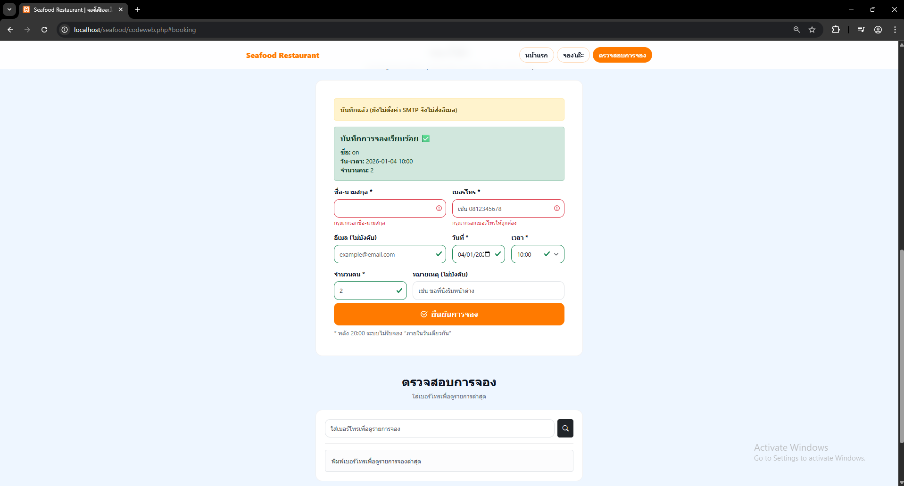
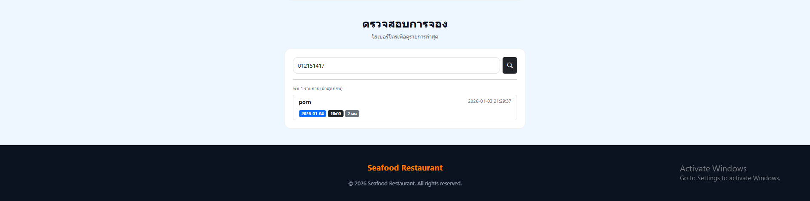

# Restaurant Booking — เว็บไซต์จองโต๊ะร้านอาหารออนไลน์ (PHP + MySQL)

โปรเจกต์เว็บแอปจองโต๊ะร้านอาหารแบบ **Single-file** พัฒนาด้วย **PHP + MySQL (PDO)**  
หน้าเว็บรองรับทุกอุปกรณ์ด้วย **Bootstrap 5** และตรวจสอบข้อมูลแบบเรียลไทม์ด้วย **jQuery**  
รองรับการส่งอีเมลยืนยันผ่าน **PHPMailer (Gmail SMTP)** *(ไม่บังคับ)*

**ผู้พัฒนา:** เบญญาภา แช่กลาง

---

## ฟีเจอร์หลัก
- จองโต๊ะออนไลน์: ชื่อ-นามสกุล, เบอร์โทร, อีเมล(ไม่บังคับ), วันที่, เวลา, จำนวนคน, หมายเหตุ
- Responsive UI รองรับมือถือ/แท็บเล็ต/คอมพิวเตอร์ (Bootstrap)
- ตรวจสอบความถูกต้องแบบเรียลไทม์ (jQuery Validation)
- ระบบเลือกเวลาจองอัตโนมัติเป็นช่วง (เช่น ทุก 15 นาที)
- กำหนดเวลาเปิด-ปิดร้าน และจำกัดเวลาจองของ “วันปัจจุบัน” (Cutoff)
- ป้องกันการจองซ้ำ (เบอร์โทร + วัน + เวลา)
- จำกัดจำนวนการจองต่อช่วงเวลา (max_per_slot)
- ตรวจสอบรายการจองย้อนหลังด้วยเบอร์โทร (แสดง 20 รายการล่าสุด)
- ส่งอีเมลยืนยัน/แจ้งเตือนร้าน (เมื่อเปิดใช้งาน SMTP)

---

## เทคโนโลยีที่ใช้
- PHP (PDO)
- MySQL / MariaDB
- HTML / CSS
- JavaScript + jQuery
- Bootstrap 5
- PHPMailer (Gmail SMTP)

---

## โครงสร้างไฟล์แนะนำ
> โค้ดหลักเป็นไฟล์เดียว แต่มีรูปประกอบและไฟล์ config เพิ่มเติม

```text
restaurant-booking/
├─ codeweb.php
├─ vibe.png
├─ padthai.png
├─ grilledshrimp.png
├─ oysters.png
├─ .gitignore
├─ .env.example
├─ composer.json
├─ composer.lock
├─ screenshots/
│  ├─ home.png
│  ├─ booking-no-email.png
│  ├─ booking-with-email.png
│  └─ check-booking.png
└─ README.md

หมายเหตุ: vendor/ จะถูกสร้างหลัง composer install และควรถูก ignore ไว้ใน .gitignore

ค่าที่ต้องมี:

APP_ENV=local
AUTO_SETUP_DB=1
SMTP_USER=yourgmail@gmail.com
SMTP_PASS=your_app_password


ถ้าใช้ Gmail แนะนำให้ใช้ App Password แทนรหัสผ่านจริง
และ ห้าม อัปโหลดไฟล์ .env ที่มีรหัสผ่านขึ้น GitHub

ถ้ายังไม่ตั้งค่า SMTP:
ระบบยังจองได้ปกติ แต่จะแจ้งว่า “บันทึกแล้ว (ยังไม่ตั้งค่า SMTP จึงไม่ส่งอีเมล)”

ค่าที่ปรับได้ในระบบ (ในโค้ด)
แก้ได้ใน $config['shop']
open / close เวลาเปิด-ปิดร้าน
cutoff_today หลังเวลานี้จะไม่รับจอง “ภายในวันเดียวกัน”
step_min ช่วงเวลาในการเลือกจอง (เช่น 15 นาที)
max_per_slot จำกัดจำนวนการจองต่อช่วงเวลา (0 = ไม่จำกัด)

ความปลอดภัยที่มีในระบบ
Session Hardening (secure / httponly / samesite)
CSRF Token
PDO Prepared Statements ป้องกัน SQL Injection
Validation ฝั่ง Server และ Client

วิธีใช้งาน
เข้าเมนู “จองโต๊ะ”
กรอกข้อมูล → กดยืนยัน
ระบบบันทึกลง MySQL และ (ถ้าเปิด SMTP) ส่งอีเมลยืนยัน
เข้าเมนู “ตรวจสอบการจอง” ใส่เบอร์โทร → ดูรายการจองล่าสุด
ภาพหน้าจอ (Screenshots)
แนะนำให้ใส่รูปไว้ในโฟลเดอร์ screenshots/ แล้วอ้างอิงแบบ path (รูปจะไม่พัง)

## ภาพหน้าจอ

### หน้าเว็บ


### จองโต๊ะ (ยังไม่ใส่อีเมล)


### จองโต๊ะ (ใส่อีเมล)


### ตรวจสอบการจอง



หมายเหตุ
รูปเมนูที่ใช้: vibe.png, padthai.png, grilledshrimp.png, oysters.png
ถ้าไม่มีรูป ระบบจะใช้ placeholder แทน
